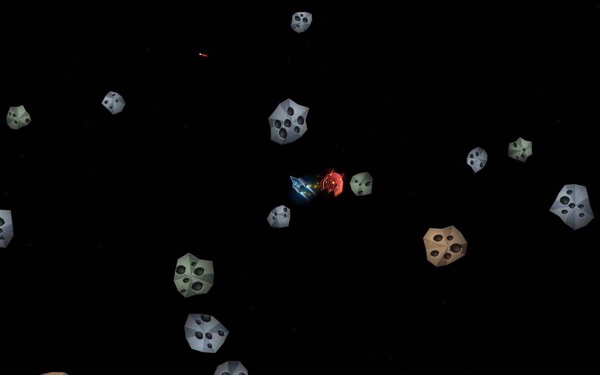
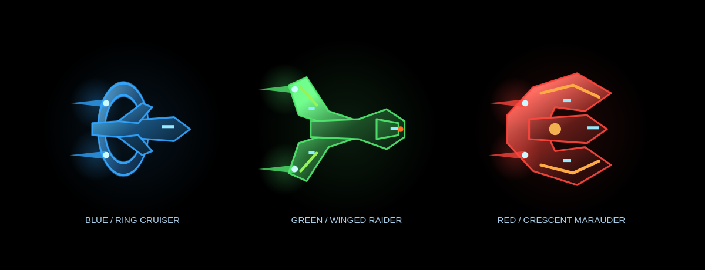
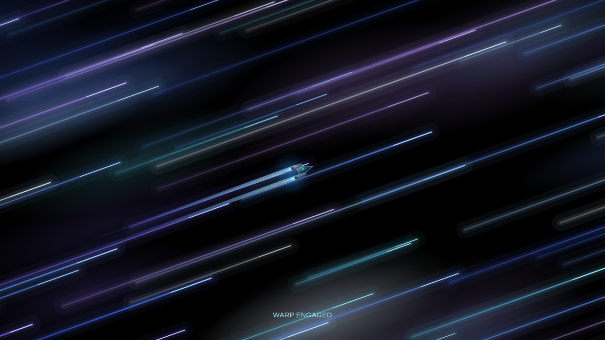

# Infinite Asteroids

A Python screensaver inspired by the 1979 arcade game: a triangular spacecraft
flies under thrust and inertia, turns to aim, and shoots tumbling asteroids that
split from large to medium to small. Fleet-inspired enemy ships frequently cross space
and fire back. The ship pilots itself, avoids approaching rocks, and leads its
shots ahead of moving targets. Destruction produces an explosion and a brief
score display, then starts a fresh flight automatically.



The background is black, with sparse parallax stars, shaded rocky asteroids
in brown, slate, and mineral-green colors, recessed craters, cracks, and grain.
The metallic ship has twin engine nacelles, a reflective blue windshield, cyan
weapon streaks, and pulsing twin exhaust jets with animated shock rings. All graphics are drawn
procedurally with antialiased Cairo vectors; no image or audio assets are needed.

## Endless space

The ship and camera use unbounded world coordinates. The camera follows smoothly
with a small velocity look-ahead, so travelling towards any screen edge continues
into new space instead of wrapping or bouncing. Nearby sectors generate
repeatable asteroid fields from their coordinates and seed. Distant asteroids
are unloaded, visited-sector history is bounded, and particles and shots expire.
This lets flights explore indefinitely without accumulating the whole universe
in memory. A new flight regenerates the field after destruction.

The classic rules include thrust/inertia, rotation, four simultaneous player
shots, bullet lifetimes, splitting rocks, saucers, and collision destruction.
Large/medium/small rocks score 20/50/100; large/small saucers score 200/1000.
The field gradually gets denser during long flights. Enemy fire also splits
rocks without awarding player points. One destruction ends a screensaver flight
and loops into the next one.

## Run

This device already has Python 3, PyGObject, GTK 3, and pycairo installed.

```sh
./launch-screensaver.sh --preview
./launch-screensaver.sh --preview --duration 20 --seed 1979
./launch-screensaver.sh
```

Preview is resizable and closes with Escape. Fullscreen mode displays a flight
on each connected monitor, hides the cursor, and closes all its windows on a
key, button, wheel, or mouse movement. Pointer movement has a startup grace
period. Changes to connected displays dismiss fullscreen mode cleanly.
Portrait, ultrawide, and high-DPI displays use the entire available viewport.

## Installation and selection

```sh
./install.sh
omarchy-launch-asteroids-screensaver force
```

The installer copies source into `~/.local/share/omarchy-asteroids`, installs
command wrappers and an application launcher, and registers **Infinite
Asteroids** in the device's Screensavers menu. Double-click the project folder's
**Infinite Asteroids Screensaver.desktop** after installation. To select it for
idle activation, use the menu or `dt-screensaver select asteroids`.

It also supports the existing secure-lock animation flow: when selected, the
ship keeps flying in frames rendered inside the lock surface while idle, and
keyboard/mouse input reveals the existing password prompt.

Re-run `./install.sh` after source changes to update the installed copy. No
administrator privileges or downloads are needed on this device.

## Headless output and verification

```sh
make test
make render
./launch-screensaver.sh --render portrait.png --width 1080 --height 1920 --seed 42
./launch-screensaver.sh --lock-frames /tmp/asteroids-lock.png --duration 5
```

`--render` simulates eight seconds by default (`--simulate` changes this) and
writes a PNG plus simulation statistics. `--lock-frames` continuously writes
atomic PNG frames and emits a `frame` notification per image, at up to 24 FPS.
Lock frames retain the display's aspect ratio with the long edge capped at
1280 pixels. Physics runs with small steps independently of the display rate.

Tests cover inertia, unbounded travel, camera following, splitting, scores,
shot limits, swept projectile collisions, saucers, enemy fire, destruction and
restart, procedural generation, memory bounds, and rendering in different
screen profiles. A seeded two-minute autonomous simulation verifies travel,
shooting, rock destruction, and automatic restarts together.

## Enemy fleets

Enemy encounters feature three original Star Trek fleet-inspired silhouettes:
a blue ring cruiser, a green swept-wing raider, and a red/copper crescent
marauder. Each has shaded plating, windows, illuminated engines, and matching
blue, green, or red weapon streaks. Small and large variants retain their
existing collision, firing, and scoring behavior.

The first encounter is eligible after 3–6 seconds. Later encounters use a
4–7 second cooldown, with one enemy active at a time. Enemy passes last up to
13.5 seconds so replacement encounters also occur more often. Each zone has its own fleet;
every warp jump changes to a different fleet. Ships launch with part of
the player's travelling velocity so they can cross the moving camera view.



## Warp-core collection

Glowing cyan warp-core parts appear randomly throughout the asteroid field.
The autopilot seeks them while avoiding rocks and firing at threats; a short
tractor pull helps catch nearby parts. Five small indicators show collection
progress, with a brief message after each pickup.

Collecting five parts automatically starts a 15-second warp jump: stars stretch
into blue and white speed streaks, the ship leaves blurred hull echoes, and
its nacelles produce long engine beams. The camera travels with the ship to a
new procedural zone 90,000–180,000 world units away. Each arrival changes the
enemy fleet, preserves the score, and consumes the five parts. Combat pauses
during warp and a brief arrival shield prevents immediate destruction. The
collection cycle then repeats. Collected parts survive destruction and respawn,
so progress toward the next warp jump continues across flights.



Warp trails run parallel to the ship’s heading, moving backwards across the
view rather than radiating toward the viewer. Core parts appear one at a time
with 42–52 seconds between collections, targeting roughly 3–5 minutes per warp.
The collection clock and core count survive respawns. Occasional green shield
pickups protect the ship for 25 seconds; orange missile pickups grant eight
homing rounds, used automatically in place of the regular gun until exhausted.
