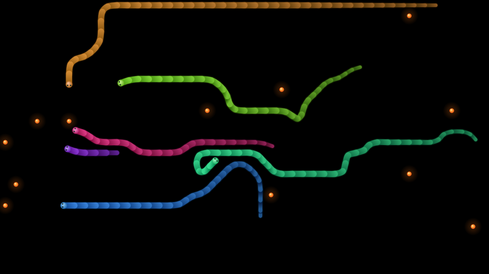

# Snake Screensaver

Autonomous, competing snakes on a black background, with smooth diagonal
motion, glowing food, tapered bodies, and synchronized travel between displays.
The project includes a portable **Windows/Linux Qt app**, the original Omarchy
GTK app, source code, tests, and per-user installation scripts.



## Quick installation

### Windows 10/11, 64-bit

1. Copy this entire folder to the PC and double-click **install-windows.cmd**.
2. Allow it to install Python 3.13 through `winget` if Python is missing. If
   winget is unavailable, install 64-bit Python 3.13 from python.org first.
3. When Windows Screen Saver Settings opens, confirm **SnakeScreensaver** is
   selected, choose the idle timeout, and click **Apply**. Use **Preview** to test.

The first installation needs internet access and several minutes to download
Qt and build the `.scr` program. Installation is per-user under
`%LOCALAPPDATA%\SnakeScreensaver`; administrator rights are not normally needed.
It selects the new screensaver and preserves your existing timeout and sign-in
preference. Use `install-windows.cmd -NoActivate` to install without selecting it.

Settings lets you turn cross-monitor travel on or off. Windows `/s` fullscreen,
`/c` configuration, and `/p HWND` embedded-preview commands are implemented.
The `.scr` must stay beside its `_internal` dependency folder. To transfer to
another compatible Windows PC without rebuilding, copy the entire generated
`dist\SnakeScreensaver` folder, then select its `.scr` in Windows.

To restore the prior saver, select it in Windows Screen Saver Settings. The
original registry selection is also saved in `previous-screensaver.json` in the
installation folder. Select another saver before deleting the installation.

### Linux

Install Python 3.10+ and venv support using your distribution's package manager.
For example, Debian/Ubuntu need `python3` and `python3-venv`; Arch/Fedora include
venv in their Python packages. Then run:

```sh
bash install-linux.sh
~/.local/bin/snake-screensaver --preview
```

This creates an isolated Python environment, downloads Qt, and installs a
**Snake Screensaver** application-menu entry. Right-click that entry for
**Start Screensaver** and **Settings**, or run:

```sh
~/.local/bin/snake-screensaver
~/.local/bin/snake-screensaver --configure
```

The fullscreen app works on X11 and Wayland. Qt may also need your distribution's
standard X11/Wayland libraries; on minimal Debian/Ubuntu X11 installations,
install `libxcb-cursor0` if Qt reports that it cannot load the xcb platform plugin.

**Automatic idle activation depends on the Linux desktop.** The installer does
not replace your screen locker or modify desktop startup files. On Hyprland or
Sway with `swayidle` installed, a simple automatic trigger is:

```sh
swayidle -w timeout 600 "$HOME/.local/bin/snake-screensaver"
```

Add that command to your compositor's autostart configuration to use it each
session. Preserve your existing screen-lock timeout. On X11, add the fullscreen
command to XScreenSaver's program list. GNOME's built-in lock screen cannot load
an arbitrary third-party screensaver; the app can still be launched manually.

The original Omarchy integration is preserved under `omarchy/`. Its README is a
historical description of the source device; it is not a portable installer.
Your existing installation on the source computer is left unchanged.

To uninstall the portable Linux app, remove
`~/.local/share/snake-screensaver`, `~/.local/bin/snake-screensaver`, and
`~/.local/share/applications/snake-screensaver.desktop`. Remove any idle command
you added. Settings live in `~/.config/snake-screensaver/settings.json`.

## Behavior and options

- Starts with one snake and one food dot; adds a snake every 20 seconds (up to
  six) and food every eight seconds (up to twelve). Small boards reduce caps.
- All snakes compete for shared food and avoid occupied cells. Trapped snakes
  respawn, and bounded growth keeps the arena moving.
- Uneaten food lasts 30 seconds, fading during its final five seconds. Its old
  location cannot host replacement food for another 30 seconds.
- Rendering smooths alternating 90-degree steps into diagonal motion. Movement
  and collisions still use the grid.
- Cross-monitor travel is enabled by default. Only overlapping portions of
  touching display edges connect. Exposed borders, gaps and corner contacts are
  walls. Display layout changes close the saver; relaunch to use the new layout.
- Key presses, clicks, scrolling, or mouse movement close fullscreen mode.
  This animation is not itself a security lock.

```sh
snake-screensaver --span-monitors
snake-screensaver --independent-monitors
snake-screensaver --preview --duration 20 --seed 42
snake-screensaver --speed 20 --cell-size 24
```

On Windows, run these options against the generated `.scr` path. The default
configuration dialog and `/s` fullscreen mode follow Windows conventions.

## Development

```sh
python3 -m venv .venv
.venv/bin/python -m pip install -r requirements.txt
.venv/bin/python src/portable.py --preview
PYTHONPATH=src .venv/bin/python -m unittest discover -s tests -p 'test_portable.py'
```

On Windows the interpreter is `.venv\Scripts\python.exe`; set `PYTHONPATH=src`.
The full suite also tests the GTK renderer and needs PyGObject/PyCairo from the
Linux distribution. Run `bash run-tests.sh` with that interpreter, or set
`PYTHON=/path/to/python`.

Sources: `src/snake.py` (engine), `topology.py` (display boundaries), `curves.py`
(smoothing), `drawing.py` (shared visuals), `qt_cairo.py` (Qt drawing adapter),
`portable.py` (Windows/Linux app), and `graphics.py` (original GTK app).

Windows builds must be made on Windows; the installer automates this. Native
Windows installation and embedded preview require validation on a Windows PC.
See `VALIDATION.md` for checks performed on this copy.

## Dependency references

- [Qt for Python installation](https://doc.qt.io/qtforpython-6/gettingstarted.html)
- [PyInstaller usage](https://pyinstaller.org/en/stable/usage.html)
- [Microsoft screen saver conventions](https://learn.microsoft.com/en-us/windows/win32/lwef/screen-saver-library)

The Python/Qt/packaging dependencies retain their own licenses. They are
downloaded by the installers rather than bundled in this source project.
